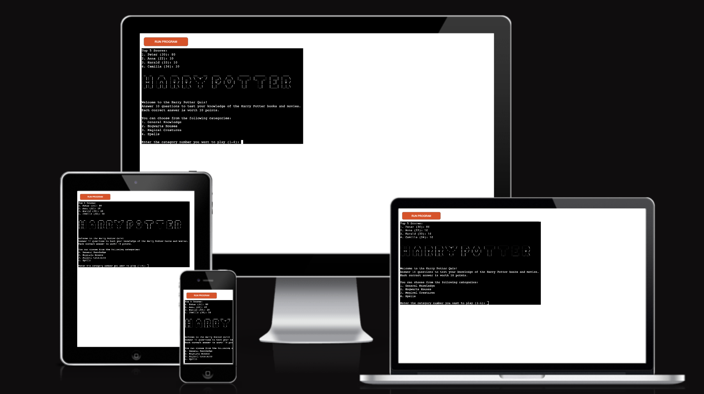

  

  <h3 align="center">Project 3 - Harry Potter Quiz</h3>

  

    My Python project for Code Institute. Harry Potter Quiz.
     
     
    <a href="https://harrypotter-quiz.herokuapp.com/" target="_blank">View Demo Website</a>
  

## Table of Contents
<!-- TABLE OF CONTENTS -->

  
Table of Contents

  <ol>
    <li><a href="#Features">Features</a></li>
    <li><a href="#How-to-Play">How to Play</a></li>
    <li><a href="#Game-Instructions">Game Instructions</a></li>
    <li><a href="#Scoring">Scoring</a></li>
    <li><a href="#Known-Bugs-and-Fixes">Known Bugs and Fixes</a></li>
    <li><a href="#Data-Model">Data Model</a></li>
    <li><a href="#Validating-&-Testing">Validating & Testing</a></li>
    <li><a href="#Credits">Credits</a></li>
  </ol>

 

# Python Harry Potter Quiz game 🧐

Test your knowledge of the Harry Potter books and movies with this fun quiz game! Answer 10 questions in each of four categories: General Knowledge, Hogwarts Houses, Magical Creatures, and Spells. Each correct answer is worth 10 points, and your score will be added to the scoreboard.

# Features

- Four categories of Harry Potter quiz questions
- Google Sheets integration for scoreboard tracking
- User authentication for name and age
- User input validation for name and age

  

---

## How to Play

1. Clone this repository to your local machine.
2. Install the necessary dependencies using: `pip install -r requirements.txt`.
3. Obtain a creds.json file for authentication with the Google Sheets API.
4. Run `python quiz.py` to start the game.
5. Choose a category (1-4) and answer 10 questions to test your Harry Potter knowledge!
6. After completing a quiz, you will be prompted to play again or quit.
7. At any time, you can view the top five scores on the scoreboard.

---

## Game Instructions

1. Choose a category by entering a number from 1 to 4 when prompted.
2. For each question, enter your answer and press Enter.
3. Your answer will be compared to the correct answer for that question.
4. If your answer is correct, you will receive 10 points.
5. If your answer is incorrect, the correct answer will be displayed and you will receive no points.
6. After 10 questions, your score will be displayed.
7. Your score will be added to the scoreboard, and the top five scores will be displayed.

---

## Scoring

- Each correct answer is worth 10 points.
- A perfect score is 100 points.
- Your score will be added to the scoreboard, and the top five scores will be displayed.

---

## Known Bugs and Fixes

* Bug reading from google sheet to the game **(*Solved*)**
* Error when choosing question answers (= categories[str(int(category) + 1)]["answers"]) **(*Solved*)**
* There are no more known bugs at this time.

---

## Data Model

**categories (dict)**

A dictionary containing four categories of Harry Potter quiz questions. Each category has a unique key, with the following properties:

- name (str): the name of the category
- questions (list of str): a list of ten quiz questions for the category
- answers (list of str): a list of the correct answers for the questions in the category

**get_player_info() (function)**

A function that prompts the user for their name and age, and returns them as a tuple.

**play_game(category) (function)**

A function that takes a category as input and plays a game of Harry Potter quiz based on the questions in that category. The function shuffles the questions, prompts the user for answers, and returns the user's score out of 100.

**scoreboard (list of dict)**

A list of dictionaries representing the top five scores on the Harry Potter quiz. Each dictionary has the following properties:

- Name (str): the name of the player
- Age (int): the age of the player
- Score (int): the player's score on the quiz

**creds.json (file)**

A JSON file containing the credentials for accessing the Google Sheets API.

**scope (list of str)**

A list of two strings representing the scopes for the Google Sheets API: "https://spreadsheets.google.com/feeds" and "https://www.googleapis.com/auth/drive".

**client (Google Sheets API client)**

A client for accessing the Google Sheets API, authenticated using the credentials in creds.json and the scope in scope.

**sheet_name (str)**

The name of the Google Sheets worksheet where the scoreboard data is stored.

**sheet (Google Sheets worksheet)**

The worksheet in the Google Sheets API where the scoreboard data is stored.

**header_row (list of str)**

A list of strings representing the headers of the columns in the scoreboard worksheet.

**scoreboard (list of dict)**

A list of dictionaries representing the top five scores on the Harry Potter quiz, read from the Google Sheets worksheet. Each dictionary has the following properties:

- Name (str): the name of the player
- Age (int): the age of the player
- Score (int): the player's score on the quiz

**scoreboard.sort() (function)**

A function that sorts the scoreboard in descending order by score.

**print() (function)**

A function that displays the top five scores on the Harry Potter quiz, as well as prompts for user input and displays quiz information and results.

---

## Validating & Testing

- Validate the code from Code Institutes [CI Pyhton Linter](https://pep8ci.herokuapp.com/) with error for trailing whitespace for the ascii art.

  

- The game is tested in diffrent browsers, Chrome, Safari and Firefox, without problem.
- The game is also tested in VScode desktop version
- The game is reading and writing to Google Sheet without problems.
- This code has been tested on Python 3.8.10 and GSpread 4.0.1. 

  

---

## License

---

## Requirements

- Python 3.x
- GSpread

---

## Customization

To customize the quiz, you can modify the categories dictionary in the code to add or remove categories and questions. 
* You can also change the creds.json file to use your own Google Sheets credentials and sheet name. 
* Finally, you can customize the messages and prompts displayed to the user in the code.

----

## Contributing

If you would like to contribute to this project, please feel free to submit a pull request or open an issue on GitHub. I appreciate any suggestions or improvements to the game.

---

## Credits

* This code was written by Camilla Centio and is licensed under the MIT License. The Harry Potter quiz questions were sourced from the movies and books about Harry Potter. 
* The Google Sheets integration was built using the GSpread library.

---

## Author

- Camilla Centio - _Initial work_ - [CamillaCentio](https://github.com/camillacentio)

---

## Contact

If you have any questions or suggestions, feel free to reach out to me at camillacentio@gmail.com